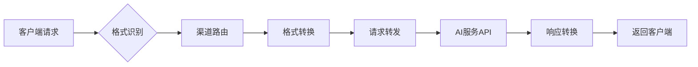

# 多渠道 AI API 统一转换代理系统 | Multi-Channel AI API Unified Conversion Proxy System

<div align="right">
  <details>
    <summary>🌐 Language / 语言</summary>
    <p>
      <a href="README.md">🇨🇳 中文版本</a><br>
      <a href="README_EN.md">🇺🇸 English Version</a>
    </p>
  </details>
</div>

## 📖 项目概述

这是一个多渠道 AI API 统一转换代理系统，支持 OpenAI、Anthropic Claude、Google Gemini 三种 API 格式的相互转换，具备多渠道管理和全面能力检测功能。


🔄 系统工作原理

### 核心转换流程



#### 🎯 1. 格式识别

- **自动检测**：根据请求路径和参数自动识别源 API 格式
- **支持格式**：OpenAI `/v1/chat/completions` | Anthropic `/v1/messages` | Gemini `/v1/models`
- **智能解析**：解析请求头、参数结构，确定源格式规范

#### 🚀 2. 渠道路由

- **Key 映射**：根据自定义 API Key 查找目标渠道配置
- **负载均衡**：支持多渠道轮询和权重分配
- **故障转移**：自动切换到备用渠道，确保服务可用性

#### ⚡ 3. 格式转换

- **请求转换**：将源格式的请求体转换为目标 API 格式
- **参数映射**：自动处理模型名称、参数结构的差异
- **兼容处理**：保持所有高级功能的完整性

#### 🌐 4. 请求转发

- **HTTP 代理**：透明转发到真实的 AI 服务 API
- **认证处理**：自动注入目标渠道的 API Key 和认证信息
- **超时控制**：可配置的请求超时和重试机制

#### 🔄 5. 响应转换

- **格式统一**：将目标 API 响应转换回源格式
- **流式支持**：完整支持 SSE 流式响应的格式转换
- **错误映射**：统一错误码和错误信息格式

## 🎯 核心功能

### 1. 智能格式转换

```bash
# 支持的转换路径
OpenAI ↔ Anthropic ↔ Gemini
  ↑         ↑         ↑
  └─────────┼─────────┘
            │
        任意互转
```

**支持的高级功能转换：**

- ✅ **流式响应**：SSE 格式的完整转换
- ✅ **函数调用**：Tool Calling 跨平台映射
- ✅ **视觉理解**：图像输入格式统一处理
- ✅ **结构化输出**：JSON Schema 自动适配
- ✅ **模型映射**：智能模型名称转换
- ✅ **OpenAI 协议声明**：支持为 OpenAI 渠道和 Gateway 显式配置 `default_target_format` 与 `supported_formats`，声明上游默认协议与支持的 Chat Completions / Responses 子协议
- ✅ **思考预算转换**：支持 OpenAI reasoning_effort ↔ Anthropic/Gemini thinkingBudget 互转
- ✅ **代理支持**：支持 HTTP/HTTPS/SOCKS5 代理，内置连通性测试

### 2. 全面能力检测

- **基础能力**：聊天对话、流式输出、系统消息、多轮对话
- **高级能力**：视觉理解、文件上传、结构化输出、JSON 模式
- **工具能力**：函数调用、工具使用、代码执行
- **模型检测**：自动获取支持的模型列表
- **多平台支持**：OpenAI、Anthropic Claude、Google Gemini

### 3. 多格式模型列表 API 📋

支持返回三种不同格式的模型列表：

- **OpenAI 格式**：`GET /v1/models` (Bearer 认证)
- **Anthropic 格式**：`GET /v1/models` (x-api-key 认证)
- **Gemini 格式**：`GET /v1beta/models` (key 参数认证)

从真实 API 获取模型数据，自动格式转换，告别硬编码模型列表。

## 🚀 快速开始

1. **安装依赖**

```bash
pip3 install -r requirements.txt
```

2. **启动 Web 服务**

```bash
python web_server.py
```

3. **访问 Web 界面**

- 打开浏览器访问：http://localhost:3000
- 选择 AI 提供商，输入 API 配置
- 一键检测所有能力，查看详细结果
- 使用转换功能，详见系统工作原理

## 🔧 .env 配置

复制 `.env.example` 为 `.env` 并根据需要修改配置：

### 管理员认证配置

- `ADMIN_PASSWORD` - 管理员登录密码（默认：admin123），用于 Web 管理界面

### 数据加密配置（可选）

- `ENCRYPTION_KEY` - API 密钥加密密钥，32 字节的 Fernet 加密密钥
- `SESSION_SECRET_KEY` - 会话加密密钥，64 字符的十六进制字符串

### Web 服务器配置（可选）

- `WEB_PORT` - Web 服务器端口（默认：3000）

### AI 服务商配置（建议）

- `ANTHROPIC_MAX_TOKENS` - Claude 模型最大 token 数限制（默认：32000）
- `OPENAI_REASONING_MAX_TOKENS` - OpenAI 思考模型 max_completion_tokens 默认值（默认：32000）

### 思考预算映射配置（建议，若不设置，在设置思考预算时可能会出错）

- `OPENAI_LOW_TO_ANTHROPIC_TOKENS` - OpenAI low 等级对应的 Anthropic token 数（默认：2048）
- `OPENAI_MEDIUM_TO_ANTHROPIC_TOKENS` - OpenAI medium 等级对应的 Anthropic token 数（默认：8192）
- `OPENAI_HIGH_TO_ANTHROPIC_TOKENS` - OpenAI high 等级对应的 Anthropic token 数（默认：16384）
- `OPENAI_LOW_TO_GEMINI_TOKENS` - OpenAI low 等级对应的 Gemini token 数（默认：2048）
- `OPENAI_MEDIUM_TO_GEMINI_TOKENS` - OpenAI medium 等级对应的 Gemini token 数（默认：8192）
- `OPENAI_HIGH_TO_GEMINI_TOKENS` - OpenAI high 等级对应的 Gemini token 数（默认：16384）
- `ANTHROPIC_TO_OPENAI_LOW_REASONING_THRESHOLD` - Anthropic token 数判断为 low 的阈值（默认：2048）
- `ANTHROPIC_TO_OPENAI_HIGH_REASONING_THRESHOLD` - Anthropic token 数判断为 high 的阈值（默认：16384）
- `GEMINI_TO_OPENAI_LOW_REASONING_THRESHOLD` - Gemini token 数判断为 low 的阈值（默认：2048）
- `GEMINI_TO_OPENAI_HIGH_REASONING_THRESHOLD` - Gemini token 数判断为 high 的阈值（默认：16384）

### 数据库配置（可选）

- `DATABASE_TYPE` - 数据库类型（sqlite 或 mysql，默认：sqlite）
- `DATABASE_PATH` - SQLite 数据库文件路径（默认：data/channels.db）

#### MySQL 数据库配置（当 DATABASE_TYPE=mysql 时使用）

- `MYSQL_HOST` - MySQL 服务器地址
- `MYSQL_PORT` - MySQL 端口号（默认：3306）
- `MYSQL_USER` - MySQL 用户名
- `MYSQL_PASSWORD` - MySQL 密码
- `MYSQL_DATABASE` - MySQL 数据库名
- `MYSQL_SOCKET` - MySQL socket 文件路径（可选，本地连接时使用）

### 日志配置（可选）

- `LOG_LEVEL` - 日志级别（DEBUG/INFO/WARNING/ERROR/CRITICAL，默认：WARNING）
- `LOG_FILE` - 日志文件路径（默认：logs/app.log）
- `LOG_MAX_DAYS` - 日志文件保留天数（默认：1 天）

## 🔧 客户端集成指南

### Claude Code 中使用

#### Mac

```bash
export ANTHROPIC_BASE_URL="https://your_url.com"
# 支持两种认证方式（任选其一）：
# 方式1：API Key认证（需要以sk-开头）
export ANTHROPIC_API_KEY="sk-xxx"
# 方式2：Bearer Token认证（使用相同的KEY值）
export ANTHROPIC_AUTH_TOKEN="sk-xxx"
claude --model your_model
```

#### Windows CMD

```cmd
set ANTHROPIC_BASE_URL=https://your_url.com
rem 支持两种认证方式（任选其一）：
rem 方式1：API Key认证（需要以sk-开头）
set ANTHROPIC_API_KEY=sk-xxx
rem 方式2：Bearer Token认证（使用相同的KEY值）
set ANTHROPIC_AUTH_TOKEN=sk-xxx
claude --model your_model
```

### Gemini-CLI 中使用

#### Mac

```bash
export GOOGLE_GEMINI_BASE_URL="https://your_url.com"
export GEMINI_API_KEY="your_api_key"
gemini -m your_model
```

#### Windows CMD

```cmd
set GOOGLE_GEMINI_BASE_URL=https://your_url.com
set GEMINI_API_KEY=your_api_key
gemini -m your_model
```

### Cherry Studio 中使用

> 选择你想转换的供应商格式，填入 url，填入你想使用的渠道的 key

## 🚢 部署指南

### Docker Compose 部署（推荐）

```bash
# 1. 克隆项目
git clone https://github.com/chinrain/Api-Conversion.git
cd Api-Conversion

# 2. 启动服务（默认使用 SQLite）
docker-compose up -d

# 3. 查看日志
docker-compose logs -f

# 4. 停止服务
docker-compose down
```

访问 http://localhost:8000 使用系统

**配置说明：**

- 默认使用 SQLite 数据库，数据存储在 `./data` 目录
- 如需使用 MySQL，编辑 `docker-compose.yml` 取消 MySQL 相关注释
- 环境变量可在 `.env` 文件或 `docker-compose.yml` 中配置
- 支持使用预构建镜像，修改 `image` 字段即可

### Docker 部署

```bash
# 构建镜像
docker build -t ai-api-detector .

# 运行容器（需要挂载数据目录以持久化数据）
docker run -p 8000:8000 -v $(pwd)/data:/app/data -v $(pwd)/logs:/app/logs ai-api-detector
```

### 本地开发

```bash
# 克隆项目
git clone <repository-url>
cd Api-Conversion

# 安装依赖
pip install -r requirements.txt

# 启动开发服务器
python web_server.py --debug
```

### Render 平台部署

项目已配置好 `render.yaml`，支持一键部署：

1. **将代码推送到 GitHub**
2. **连接 Render 平台**：https://dashboard.render.com
3. **自动部署**：Render 会自动读取配置并部署

**配置详情：**

- **构建命令**：`pip install -r requirements.txt`
- **启动命令**：`python web_server.py --host 0.0.0.0 --port $PORT`
- **环境变量**：`PYTHONPATH=/opt/render/project/src`

## 📊 支持的能力检测

| 能力       | 描述          | OpenAI | Anthropic | Gemini |
| ---------- | ------------- | ------ | --------- | ------ |
| 基础聊天   | 基本对话功能  | ✅     | ✅        | ✅     |
| 流式输出   | 实时流式响应  | ✅     | ✅        | ✅     |
| 系统消息   | 系统指令支持  | ✅     | ✅        | ✅     |
| 函数调用   | 工具使用能力  | ✅     | ✅        | ✅     |
| 结构化输出 | JSON 格式输出 | ✅     | ✅        | ✅     |
| 视觉理解   | 图像分析能力  | ✅     | ✅        | ✅     |
| 思考预算   | 智能思考功能  | ✅     | ✅        | ✅     |

## 📄 许可证

MIT License

## Star History

[](https://www.star-history.com/#chinrain/Api-Conversion&Date)
